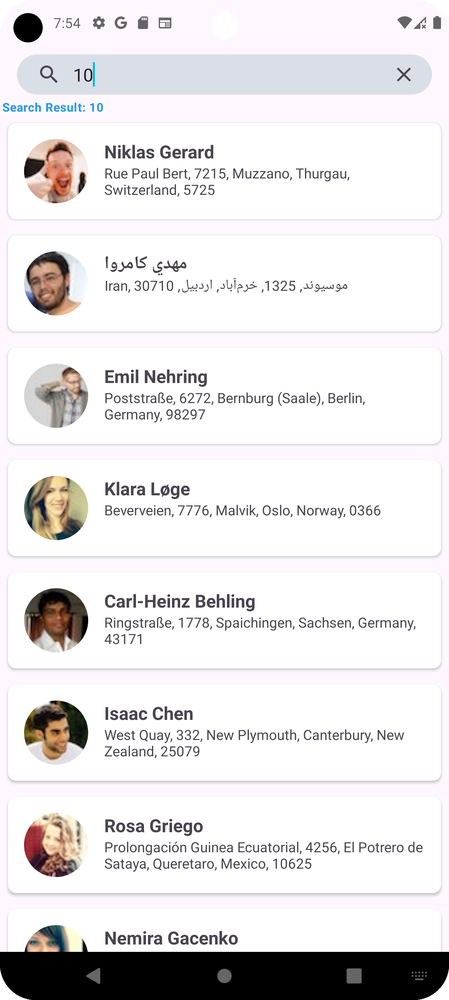
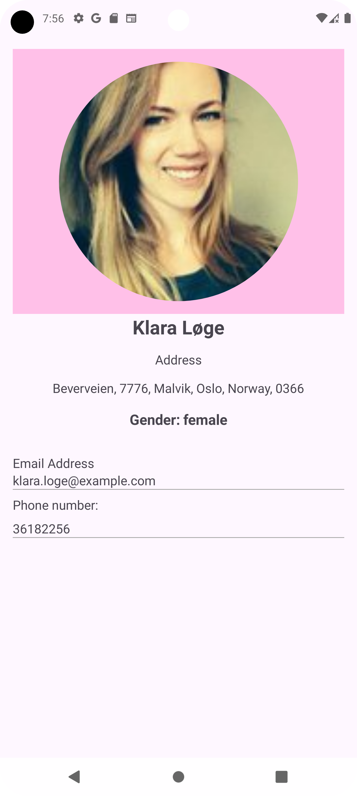

# Random User Generator App

This is a demo Android application that allows users to input a number and fetch a corresponding number of random users from the [randomuser.me](https://randomuser.me) API. The app demonstrates the use of **MVVM (Model-View-ViewModel)** and **Clean Architecture** principles for better code organization and maintainability.

 <!-- Adjust width as needed -->
 <!-- Adjust width as needed -->

## Features

- Users can input the number of random users to retrieve.
- Displays a list of random user information.
- Utilizes modern Android development practices.

## Technologies Used

The app is built using the following technologies:

- **[Jetpack Navigation Component](https://developer.android.com/guide/navigation)**: Simplifies navigation between different screens in the app.
- **[Data Binding](https://developer.android.com/topic/libraries/data-binding)**: Allows you to bind UI components in layouts to data sources in your app.
- **[ViewModel](https://developer.android.com/topic/lifecycle/architecture#viewmodel)**: Manages UI-related data in a lifecycle-conscious way.
- **[StateFlow](https://kotlinlang.org/api/kotlinx.coroutines/kotlinx-coroutines-core/kotlinx/coroutines/flow/StateFlow.html)**: A state-holder observable flow that emits updates to its collectors.
- **[Retrofit](https://square.github.io/retrofit/)**: A type-safe HTTP client for Android and Java for making network requests.
- **[OkHttp](https://square.github.io/okhttp/)**: An HTTP client for Android and Java applications that helps in making efficient network requests.
- **[Glide](https://bumptech.github.io/glide/)**: An image loading and caching library for Android.
- **[Dagger Hilt](https://developer.android.com/training/dependency-injection/hilt-android)**: A dependency injection library that reduces the boilerplate code needed for Dagger.

## Architecture

The app is structured using:
- **MVVM**: Separates the UI logic from the business logic.
- **Clean Architecture**: Ensures the code is modular and easy to test.

## Secrets Management

Secrets are managed through a properties file:

```groovy
secrets {
    propertiesFileName = "local.properties"
    defaultPropertiesFileName = "local.properties"
}
